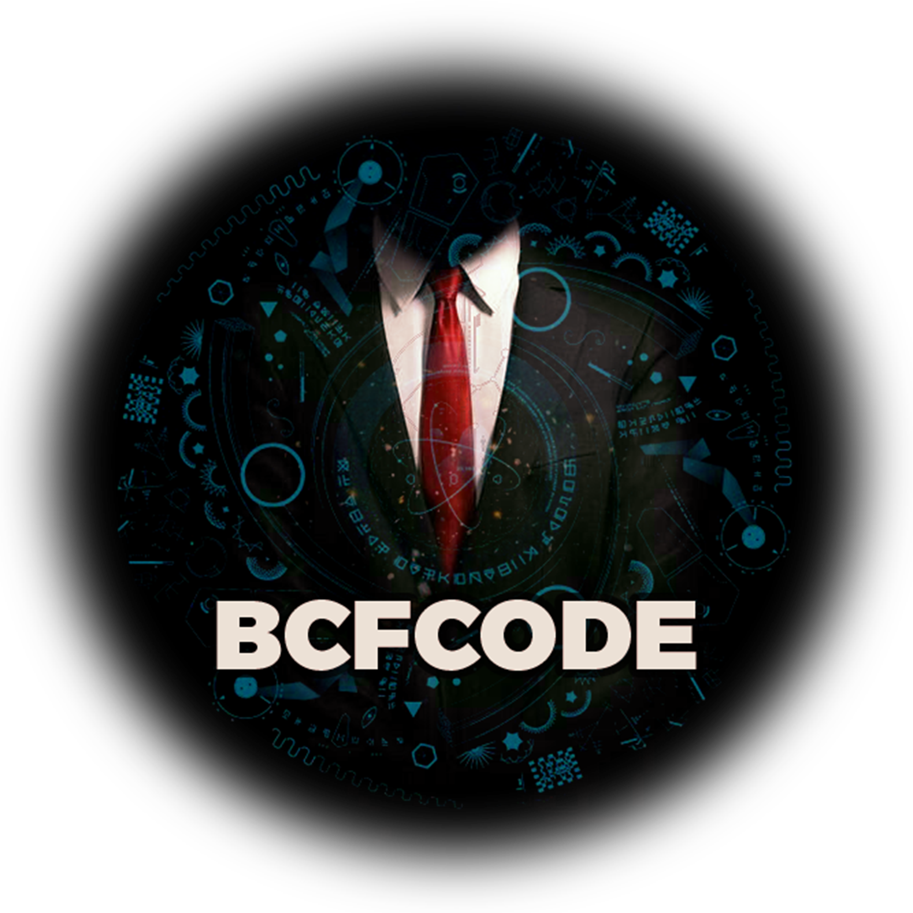

# FocusToDo Speed-Tracker App

"A simple app to measure the velocity of time and receive 1000 hours."

# Here is the list of developers working on this project:

Front-End Developers:
- <a href="https://www.linkedin.com/in/morteza-bakhshandeh-813598260/" style="color: yellow;">Morteza Bakhshandeh</a>
- <a href="https://www.linkedin.com/in/majid-babak-aab039156/" style="color: yellow;">Majid Babak</a>

# [©BCFCODEteam](https://github.com/BCFCODE)
[Join our Telegram channel](https://t.me/BCFCODE) | [Follow on Instagram](https://www.instagram.com/bcfcodeteam/?igshid=MzRlODBiNWFlZA%3D%3D)

  

